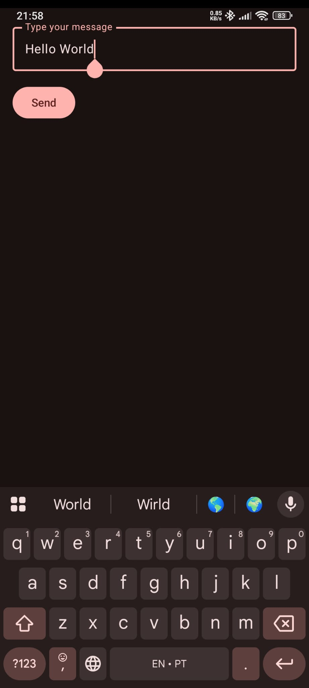
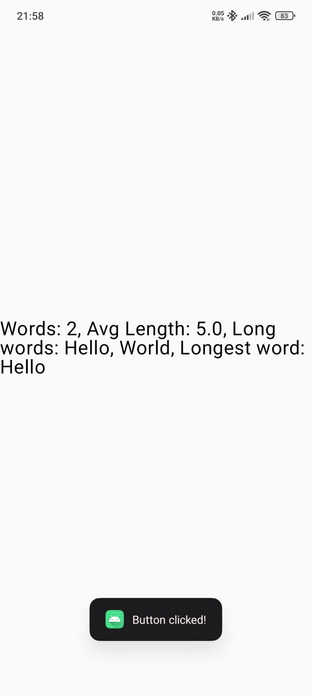
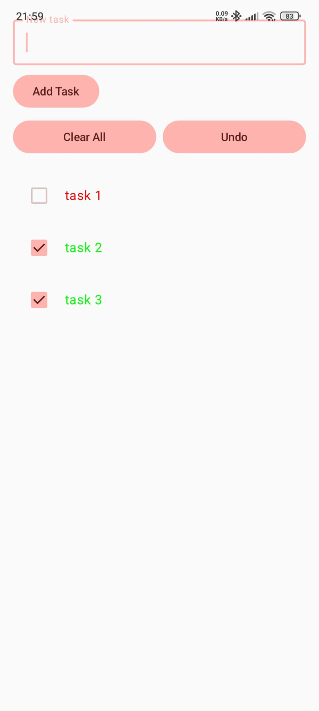
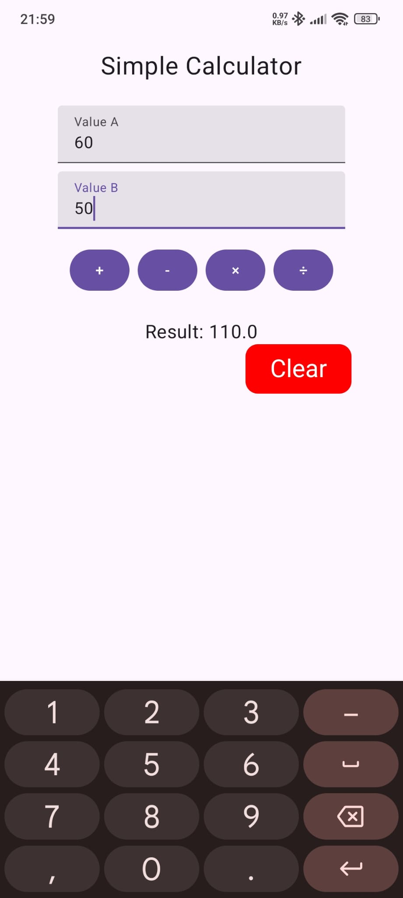
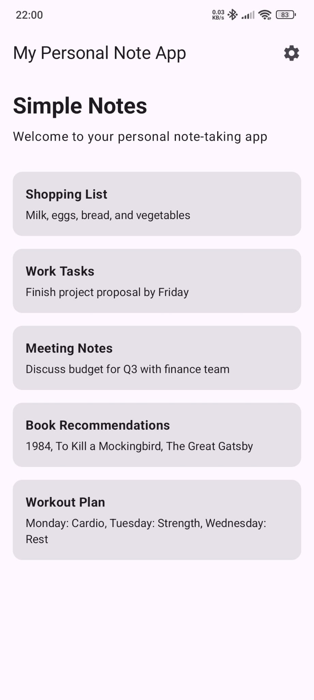
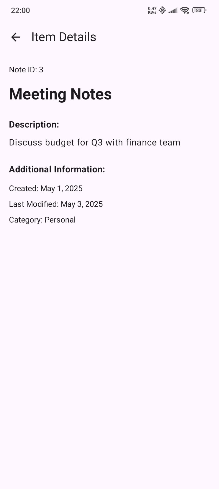
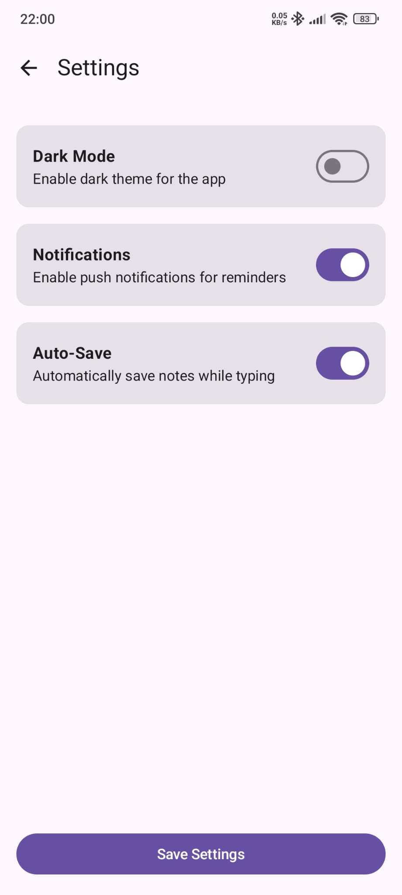
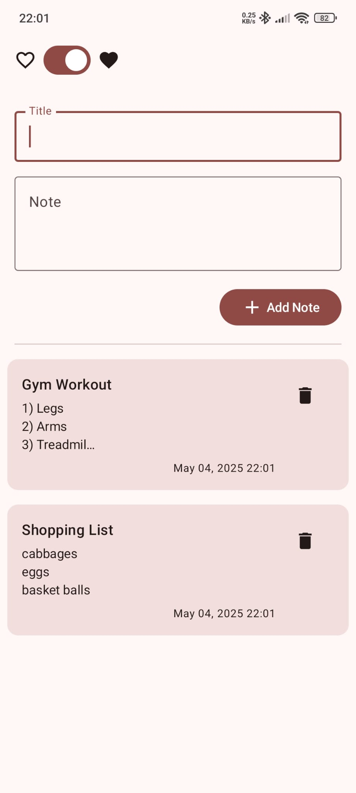
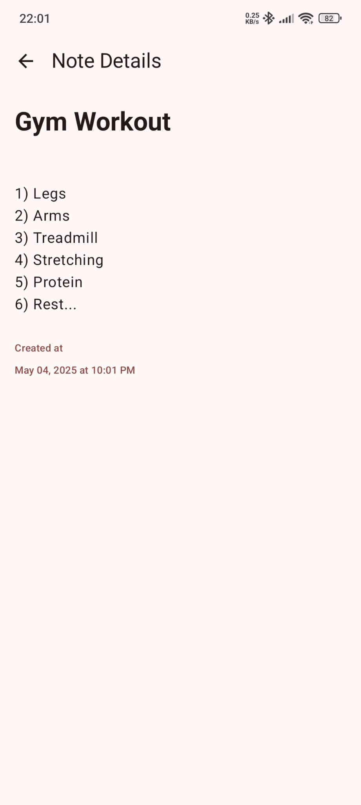

# Android App Gallery

A quick visual tour of simple Android apps demonstrating basic UI, data handling, and functionality.

---

## 1. Hello Android

A minimal “Hello, World!” starter app.

<p align="center">
  
  
</p>

---

## 2. To-Do List App

Track tasks with add, complete, and delete (tap on top of task) functionality.

<p align="center">
  
</p>

---

## 3. Simple Calculator

Basic arithmetic operations with a straightforward layout.

<p align="center">
  
</p>

---


## 4. Simple Note

A take on note-taking, with an emphasis on editing and deleting entries.

<p align="center">
  
  
  
</p>

---

## 5. Notes App

Create, view and delete notes with a simple, clean interface.

<p align="center">
  
  
</p>

---

## Getting Started

1. Clone this repository:
   ```bash
   git clone https://github.com/guilhermeleitao2002/Basic-Apps.git
    ```

2. Open your preferred Android IDE (e.g. Android Studio).

3. Import the project folder.

4. Build and run on an emulator or physical device.